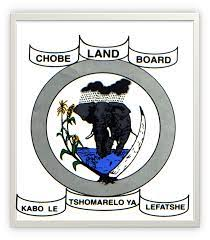

# Welcome to Chobe Open-LUCIS (COL) training

## Introduction

The Chobe District is one of the most rich and diverse regions with natural resources, ethnicity, and culture in Botswana. Due to the abundance of resources in the district, alongside local communities who are highly dependent in natural resources including forests, rivers, agricultural land and wildlife, Chobe is characterised by high prevalence of land-use conflict which ultimately lead to the prevailing human-wildlife conflict. These conflicts are mainly due to competition between people-and-people and people-and-wildlife for limited land and other resources like water and grazing areas. Working in close collaboration with the Chobe Land Board (CLB) and the District Land Use Planning Unit (DLUPU), the Chobe Open-LUCIS (COL) project aims to build capacity with local stakeholders and enhance informed decision-making in land management and sustainability in land use to cater for the needs of the District. 

## COL Training

One of the COL project objectives is to help build local capacity in applying tools
empowered by Remote Sensing (RS) and Geographic Information System (GIS)
technologies to inform and ensure sustainable land use practices in Chobe.

### [COL Workshop - Land-Use Suitability Analysis with QGIS Tools](training/1_lu/modules)

> **Instructor**: [Dr. Changjie Chen](https://github.com/chjch) (<ins>chj.chen@<i></i>ufl.edu</ins>).&nbsp;&nbsp;&nbsp;&nbsp;
> **Date**: November 22-24, 2023. 
> **Co-authors**: Mogae Makonyela, Silas Achidago and Lynn Fanikiso

1. [Module 1 - Software and Data Preparation](https://github.com/mogaetkpp/GALUP/tree/master/training/1_lu/modules/module1.md)
2. [Module 2 - Introduction to LUCIS-OPEN Tools for QGIS](https://github.com/mogaetkpp/GALUP/tree/master/training/1_lu/modules/module2.md)
3. [Module 3 - Create Suitability Models with QGIS Graphical Modeler](https://github.com/mogaetkpp/GALUP/tree/master/training/1_lu/modules/module)
4. [Module 4 - Aggregate Results to Make Land-Use Decisions](https://github.com/mogaetkpp/GALUP/tree/master/training/1_lu/modules/module)

## Documentation

1. [LUCIS-OPEN Tools for QGIS](https://github.com/SERVIR-WA/GALUP/wiki/Tools)
2. [Agriculture Models](https://github.com/SERVIR-WA/GALUP/wiki/models_ag)

## COL Project Partners

We appreciate all the support from our partners below: 

<table style="border: 0;">
  <tr> 
    <td vlign="center" style="border: 0;"></td>
    <td vlign="center" style="border: 0;"></td>
    <td vlign="center" style="border: 0;"></td>
    
  </tr>
</table>
 
<table>
  <tr>    
    <td></td>
    <td></td>
    <td></td>
    <td></td>
    <td></td>
    </tr>
</table>
