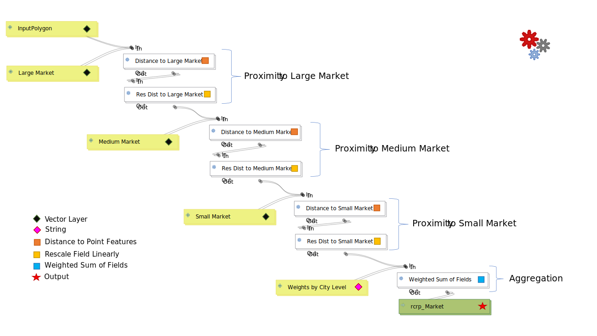

# Module 3 - Exercise 2

## 1. Skills Practiced

This exercise will practice:

- **QGIS Graphical Modeler**
- **Market Model**

## 2. Modeling Market Proximity for Row Crops Farming

### 2.1 Model methodology

In this model, market refers to the human settlements where harvested crops
can be sold.
Market proximity is a critical factor when selecting suitable locations for
row crops farming because distances to large, medium, and small markets
(human settlements of different magnitudes) influence the sale potential of
harvested crops.

**Market model** aims to evaluate the suitability of IDUs in the Pandamatenga Landscape for planting row crops by measuring the distance between each IDU and
those markets (i.e., large market, medium market, and small market).

### 2.2 Model Datasets

The following datasets are used in the landscape condition model:

- _PND\_IDUs.shp_ at
  `GALUP-master -> training -> 1_lu -> datasets -> Pandamatenga Landscape IDUs`
- _Large\_Market.shp_ at
  `GALUP-master -> training -> 1_lu -> datasets -> Pandamatenga Crop Markets`
- _Medium\_Market.shp_ at
  `GALUP-master -> training -> 1_lu -> datasets -> Pandamatenga Crop Markets`
- _Small\_Market.shp_ at
  `GALUP-master -> training -> 1_lu -> datasets -> Pandamatenga Crop Markets`

## 3. Instruction

1. Locate _Large\_Market.shp_, _Medium\_Market.shp_, _Small\_Market.shp_ and
   _PND\_IDUs.shp_ in the **_Browser Panel_** and add them to
   **_Map Canvas_**.
2. In the _Menu Toolbar_, click _Processing_ and open
    `Graphical Modeler...` .
3. In the **_Model Properties_** panel, name the _Name_ as **Market**, and
   the _Group_ as **Economic**.
4. In the **_Inputs_** panel, click the **_Inputs_** tab, and **add**:
   - a _Vector Features_ input, and name the _Parameter name_ as
     **1_Input Polygon** and leave others as default, then click **OK**.
   - ***three*** _Point_ inputs, and set the _Parameter name_ as
     **2_Large markets**, **3_Medium markets**, and **4_Small markets**
     respectively, and leave others as default, then click **OK**.
   - a _String_ input, set the _Description_ as
     **5_Weights by Market Level** and type `0.6, 0.3, 0.1` as the
     _Default value_ (weights for Large markets, Medium markets, and Small
     markets), and then click **OK**.
5. Parameter settings for each **algorithm**: 
   
6. **Edit** inputs names, i.e., delete the prefixes (number and underscore) in
   front of their names.
7. Now you have finished the model.
   Click  `Run model`  on the top menu
   bar of the window to **run** the _Market_ model.
8. Set the model as follows:
   - **Input polygon**: _PND\_IDUs_.
   - **Large cities**: _Large\_Market_.
   - **Medium cities**: _Medium\_Market_.
   - **Small cities**: _Small\_Market_.
   - Leave the rest of the parameters as default.
   - Click **Run**.
9. Now, let's set up the **Symbology** of the output layer _rcrp\_Market_.
   Open the
   
   **Symbology** tab from the **Layer Properties** window.
   Select the 
   *Graduated style*.
   Specify the _Market_ field as **Value**, and then choose the _BuPu_ color
   ramp with **5** classes.
   Click **Apply**.
10. Create a _Layout_ for the map, and then add _Legend_, _Scale bar_, and
    _North Arrow_ to it.
11. Export the map as a PDF file.

## 5.Result

- Upon completion, the map you got should look similar to this pdf
  [here](../pdf_maps/rcrp_MarketPND.pdf).
- Now you have completed all exercises. Please go back to
  [Module 3](https://github.com/mogaetkpp/GALUP/blob/master/training/1_lu/modules/module3.md#5-Exercises) to turn in them.
